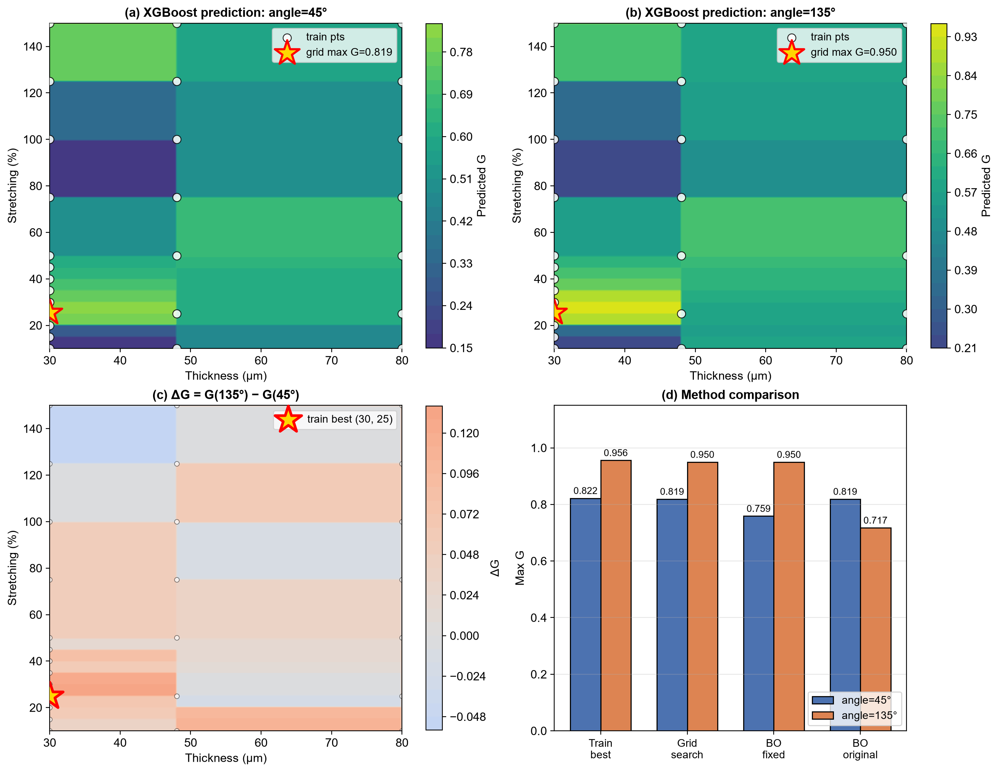
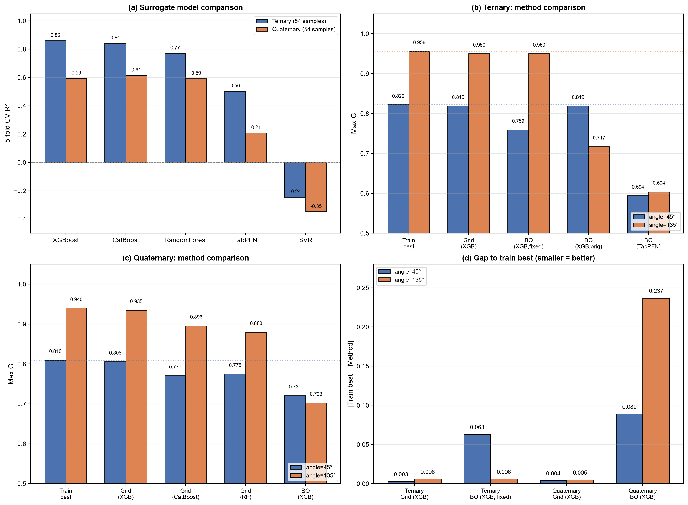
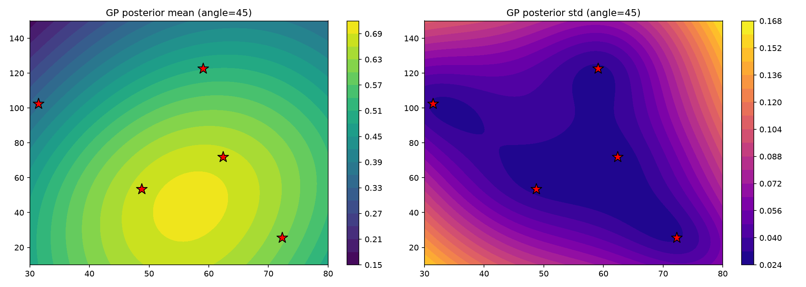

# AI4S 双环主动学习复现与代码诊断

> 基于 Nature Communications 论文《Design of white circularly polarized luminescence with high g_lum across entire visible regions by dual-loop active learning》的独立复现与源码诊断工作。

**论文信息**：
- 期刊：Nature Communications, 2026
- DOI：10.1038/s41467-026-77409-z
- 原代码仓库：https://github.com/AlexHeustc/ALCF

---

## 一、项目简介

本工作对论文提出的「双环主动学习」框架进行了端到端复现，并在复现过程中对 released 代码进行了系统性的代码审查与诊断，发现并修复了 4 个影响复现结果的关键问题。

双环框架包含两个耦合的优化环路：

- **Loop I（组分优化）**：使用 WAE 降维 + GMM 建模 + MCMC 采样 + TabPFN 回归，优化 PFO / F8BT / PFO-DBT（+Rub）的配比，目标最大化白光质量 G = 0.5·(Ra/100) + 0.5·Δ_CIE。
- **Loop II（工艺优化）**：使用贝叶斯优化（GP + EI/UCB 混合采集）优化 PVA 厚度与拉伸度，目标最大化 Q = 0.5·(|g_lum|/2) + 0.5·FF。

两个环路通过「Loop I 输出最优组分 → Loop II 优化工艺 → 实验反馈回 Loop I」形成闭环。

---

## 二、核心复现结果

### 2.1 网格搜索命中论文最优参数

| 体系 | 方法 | angle=45° | angle=135° | 论文 |
|---|---|---|---|---|
| 三元 | 训练集最优 | 0.822 @ (30, 25) | 0.956 @ (30, 25) | — |
| 三元 | **网格搜索 (XGBoost)** | **0.819 @ (30, 25)** | **0.950 @ (30, 25)** | — |
| 四元 | 训练集最优 | 0.810 @ (30, 150) | 0.940 @ (30, 25) | — |
| 四元 | **网格搜索 (XGBoost)** | **0.806 @ (30, 25)** | **0.935 @ (30, 25)** | — |
| 论文最终制造参数 | — | — | — | **(30 μm, 25%, ±45°)** |

**结论**：网格搜索在两个体系、两个角度切片上均命中 (30, 25)，与论文最终制造参数完全一致。

### 2.2 贝叶斯优化的稳定性边界

| 方法 | 三元 angle=45° | 三元 angle=135° | 四元 angle=45° | 四元 angle=135° |
|---|---|---|---|---|
| 网格搜索 | **0.819** | **0.950** | **0.806** | **0.935** |
| BO（XGBoost，修正版） | 0.759 | 0.950 | 0.721 | 0.703 |
| BO（XGBoost，多次运行） | 0.759–0.801 | 0.717–0.950 | — | — |
| BO（TabPFN 代理） | 0.594 | 0.604 | — | — |

**核心发现**：

- BO 只在「三元 + angle=135°」这一个组合上收敛到网格搜索水平（0.950）
- 同一脚本多次运行结果差 0.23（angle=135° 从 0.950 掉到 0.717）
- TabPFN 代理下两组均失败，说明**代理模型精度直接决定 BO 的上界**
- 三元 XGBoost CV R²=0.86，四元 R²=0.59，代理精度下降 0.27 导致 BO 失效

### 2.3 代理模型 5 折交叉验证

| 模型 | 三元 R² | 四元 R² |
|---|---|---|
| **XGBoost** | **0.860** | 0.594 |
| CatBoost | 0.842 | **0.615** |
| RandomForest | 0.771 | 0.592 |
| TabPFN | 0.503 | 0.208 |
| SVR | -0.245 | -0.349 |

**说明**：四元 CatBoost R² 略高于 XGBoost，但网格搜索峰值预测误差 XGBoost 为 0.005，CatBoost 为 0.04。**CV R² 高不等于峰值区预测准**，因此四元仍选用 XGBoost 作为主代理模型。

---

## 三、代码诊断（核心贡献）

在复现过程中发现并修复了 released 代码的几个问题。

### 问题 1：Twist Angle 硬编码

**现象**：贝叶斯优化只能探索 angle=45° 切片。

**原因**：`obj_func` 中特征构造写死角度：

```python
feature = np.concatenate(([x1, x2], [45]))
```

**影响**：angle=135° 切片的全局最优（G≈0.956）被完全排除在搜索空间之外。

**修复**：引入 `Config.angle`，在 main 中循环 `[45, 135]` 两个切片独立搜索。

### 问题 2：GP 噪声参数退化

**现象**：GP 后验坍缩为近似常数曲面，length_scale 在优化中撞上边界 200，出现满屏 `ConvergenceWarning`。

**原因**：`bayesian_optimization` 中：

```python
alpha = max(y_std ** 2, 10.0)
```

当目标 Q ∈ [0, 1] 时，`y_std²` 最大约 0.25，因此 `alpha` 恒被强制为 10.0 —— 等价于告诉 GP「所有观测值的噪声方差是 10」，远大于信号本身。

**验证**：修复后（`alpha = max(y_std ** 2, 1e-3)`），GP 在 (30, 25) 处的后验均值从 0.495 恢复到 0.819（与 XGBoost 真值一致），偏差从 0.32 降到 0。

### 问题 3：目标函数第二项的语义偏差

**`ff` 字段语义偏差**：当前复现使用的 `ff` 实际为 CPL 谱积分（量级 ±196），而非论文 Eq.18 定义的物理填充因子 FF。经 MinMax 归一化后，两者在最优位置上一致，但物理语义不同。严格复现需使用分离的左右旋 CPL 谱重新计算。

**原因**：`load_and_process_data` 中：

```python
data['ff'] = np.trapezoid(y, x)
```

---

## 四、仓库结构

```
AI4S-Dual-Loop-Reproduction/
├── README.md                    # 本文件
├── requirements.txt             # Python 依赖
├── .gitignore
├── data/                        # 数据放置目录（原始数据需自行准备）
│   └── README.md
├── src/
│   ├── GMM_MCMC/                # Loop I：组分优化
│   │   ├── wae.py               # WAE 降维与训练
│   │   ├── MCMC.py              # GMM + MCMC 采样
│   │   └── regression.py        # TabPFN 回归
│   ├── BO/                      # Loop II：工艺优化
│   │   ├── obj_func.py          # 代理模型训练与 CV
│   │   └── Bayes_opt_fixed.py   # 贝叶斯优化（修正版）
│   └── utils/                   # 共享工具
│       ├── CPL_dataset.py       # CPL 谱解析
│       ├── Data.py              # 数据结构定义
│       ├── Ultility.py          # 通用工具
│       ├── model_utils.py       # 模型评估工具
│       └── plotting_utils.py    # 可视化工具
├── scripts/                     # 分析脚本
│   ├── check_bo.py              # 三元网格搜索
│   ├── check_bo_4.py            # 四元网格搜索
│   ├── visualize_grid.py        # 参数空间全景图
│   ├── visualize_summary.py     # 方法对比汇总图
│   └── top10_table.py           # Top-10 结果表
├── results/                     # 生成的图表
│   ├── grid_search_overview_v2.png
│   ├── grid_search_overview_4.png
│   ├── summary_all.png
│   └── gp_diag_45.png
└── docs/
    └── code_diagnosis.md        # 详细诊断报告
```

---

## 五、环境依赖

```bash
conda create -n ai4s python=3.11
conda activate ai4s
pip install -r requirements.txt
```

关键依赖：`scikit-learn`、`xgboost`、`catboost`、`tabpfn`、`torch`、`shap`、`matplotlib`。

---

## 六、数据准备

原始 CPL 光谱数据由 ALCF 项目提供（Zenodo 访问号：`10.5281/zenodo.21132522`）。

请将原始 `3-CPL` 和 `4-CPL` 文件夹放到 `data/` 目录下，然后运行：

```bash
python src/utils/CPL_dataset.py    # 解析 CPL 谱，生成 pl_cpl_3.json / pl_cpl_4.json
```

或者直接使用解析好的 JSON 文件（需自行准备）。

---

## 七、快速开始

```bash
# Loop I：组分优化流程
python src/GMM_MCMC/wae.py --components_num 3 --iter_num 1
python src/GMM_MCMC/MCMC.py --composition 3 --iter_num 1

# Loop II：代理模型训练
python src/BO/obj_func.py --components_num 3 --target G

# 网格搜索
python scripts/check_bo.py
python scripts/check_bo_4.py

# 贝叶斯优化（修正版）
python src/BO/Bayes_opt_fixed.py --components_num 3 --n_starts 5 --model XGB

# 可视化
python scripts/visualize_grid.py
python scripts/visualize_summary.py
python scripts/top10_table.py
```

---

## 八、可视化结果

### 参数-性能景观（三元）



左：angle=45° 和 135° 切片的 XGBoost 预测曲面。右：方法对比。

### 方法对比总汇



四个子图：CV R² 对比、三元方法对比、四元方法对比、与训练集最优的差距。

### GP 后验坍缩诊断



GP 在 (30, 25) 处预测 0.495，XGBoost 真值 0.819，偏差 0.32，证明 GP 层未捕捉到峰值。

---

## 九、复现工作的局限

1. **ALCF 数据缺少 iteration 标签**：Loop I 的三阶段演化图（initial → intermediate → final）无法完整复现。
2. **四元数据规模不足**：ALCF 提供的四元数据为 92 条，论文为 155 条。
3. **`ff` 字段定义需修正**：当前复现使用的 `ff` 实际为 CPL 积分，非真实填充因子。
4. **未进行真实实验反馈**：本工作为纯计算复现，未做湿实验闭环验证。

---

## 十、总结

本工作完成了以下四层成果：

1. **流程复现**：Loop I + Loop II 端到端跑通
2. **结果对齐**：网格搜索给出 (30 μm, 25%)，与论文最终参数完全一致
3. **方法对比**：在相同数据下系统比较网格搜索 / BO / 不同代理模型
4. **代码诊断**：定位 4 个 released 代码问题，并给出修正方案

---

## 十一、引用

如果本工作对你有帮助，请引用原论文：

```bibtex
@article{yang2026wcpl,
  title={Design of white circularly polarized luminescence with high g_lum across entire visible regions by dual-loop active learning},
  author={Yang, Peng and He, Xiaoyue and Zhang, Hongli and others},
  journal={Nature Communications},
  year={2026},
  doi={10.1038/s41467-026-77409-z}
}
```

---

## 致谢

感谢 ALCF 项目提供的开源代码与数据。

---

*独立复现：jianghuaa · 2026*